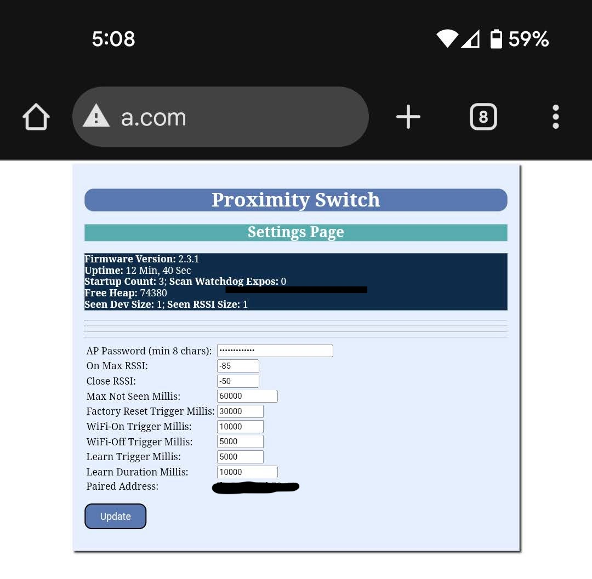

# presence-aware-switch (ProxiSwitch)
This is firmware for ESP-32 for use as a presence aware switch using a Bluetooth LE Beacon device.

## The Device
The final device once assembled is a box with a power cord, an electrical outle, a push button and two LEDs.

When one places a BlueTooth LE beacon near the device, one of the LEDs lights up (Close LED) indicating a compatible device in close range. This is known as the close device LED. 

This LED is a great way of being sure the device sees a device prior to it being learned and tracked. It is also a way for the device to indicate that something else is close enough that its signal may interfere with the learning of a desired device.

## The Close LED
In normal operating mode the Close LED will be continuously lit while a beacon device is in close proximity, however it is also used to indicate when WiFi is on/enabled.
When the device is in WiFi on/enabled mode, the Close LED will blink rapidly and no longer indicate close devices as the device is not able to pair/learn devices when in this mode.

In the above image the Close LED for this device is a Blue LED.

## The Learn LED
The learn LED is used to indicate when the device is in learning mode. It also indicates the device is doing a factory ressset when the Learn LED flashes rapidly.

In the above image the Learning LED for this device is a Yellow/Orangeish LED.

## The Button
The button on the device is the primary way in which a user interacts with the device. The button allows the user to cause the device to learn a near Bluetooth LE Beacon, it allows for the enabling/disabling of WiFi and it is used to force the device to do a factory reset.

### Learning a Device
To learn or start tracking a beacon, the beacon should be placed as close as possible to the device. The Close LED should light up. Then press the button on the device and hold for about 5 or 6 seconds, at which time the Learning LED will turn on. At that time release the button and leave the beacon near the device. The LED will go out once loearning is complete. This takes about 10 seconds.

After a beacon has been learned, when it is near the device, the device will power on the box's outlet. When the beacon is far from the device and not seen in more than 1 minute the device will power off the outlet until it next sees the beacon again.

### WiFi Enable/Disable
The device can be placed into WiFi AP mode so that one can connect to the device and modify the device's settings. To do this one must enable the WiFi. This enabling/disabling of the WiFi is neccessary because
the device's BlueTooth and WiFi share resources resulting in a reduced performance of the BlueTooth capabilities while WiFi is enabled. To combat this the WiFi can be switched on and off so it is turned on only when one 
needs to configure the device, then switched off when the configuration is done.

To enable the WiFi when in regular mode, press and hold the button for about 10 seconds, at which time the Close LED will start to flash rapidly, then release the button. The Close LED will remain
flashing rapidly the entire duration the WiFi is on. When in WiFi Enabled mode, you can disable the WiFi by holding the button until the close LED goes out, then releasing the button will disable the WiFi.

While the WiFi is enabled the device will emit an SSID similar to the one pitured below:

The SSID will be the word `ProxiSwitch_` followed by an ID that uniquely identifies that device.

To connect to the WiFi you must use the default password of `P@ssw0rd123`. This password can and should be changed via the settings page. 
Then in a web browser simply pull up any web address because the device acts as a captive portal and will take you to the settings page regardless of the URL entered.

The settings page looks similar to the below image:

In the settings page, only changing the WiFi password will result in a reboot of the device. When that happens the device will power cycle and the new passsword will be used from that point on. The reboot currently happens without warning and your connection to the device will go away and the WiFi will shut off automatically. For all other settings changes the device will simply apply the settings and a banner at the bottom of the page will indicate that the settings have been applied. When you are done applying settings which do not result in a reboot of the device, you will need to presss and hold the device Button for about 5 seconds, until the Close LED goes out, then release it and the WiFi will be disabled.

It is also worth noting that the device cannot be put into learn nor factory reset mode while the WiFi is enabled.

### Factory Reset
To cause the device to perform a factory reset you can press and hold the device button for about 30 seconds, at which time the Learn LED starts flashing, then release the button and the device will factory reset forgetting any tracked beacon and resetting all the custom setting including WiFi password to their initial defaults.

### An Inside Look
Below is an image of the inside of the device. Keep in mind that this is really a kind-of working prototype device. There are many things I would change about it and lessons learned now that the device is working. Maybe one day I will make those improvements in a new device.

